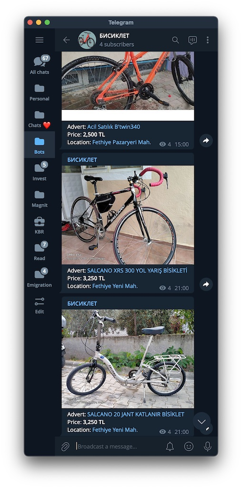

# sahibinden-bot



Bot that tracks new ads at sahibinden.com and notifies telegram channel

## Configuration

Sahibinden-bot can be configured using environment variables.
The optimal way is to create a file named `.env` in the root `sahibinden_bot` directory.

```bash
SAHIBINDEN_SOURCE_URL='https://www.sahibinden.com/en/bicycles?address_town=655&address_city=48'

TELEGRAM_BOT_TOKEN='bot_token'
TELEGRAM_CHANNEL_ID='channel_id '

AWS_ACCESS_KEY_ID='aws_access_key_id'
AWS_SECRET_ACCESS_KEY='aws_access_key_id'
AWS_BUCKET_NAME='aws_bucket_name'
AWS_ENDPOINT_URL='https://s3.amazonaws.com'
```

SAHIBINDEN_SOURCE_URL: The URL of the search results page to scrape.

Optional integration with Sentry.

```bash
SENTRY_DSN='sentry_dsn'
```

As a reliable way of requesting sahibinden.com, sahibinden-bot optionally uses a proxy.

```bash
PROXY_URL='http://user:pass@ip:port'
PROXY_URL_BACKUP='http://user:pass@ip:port'
```
